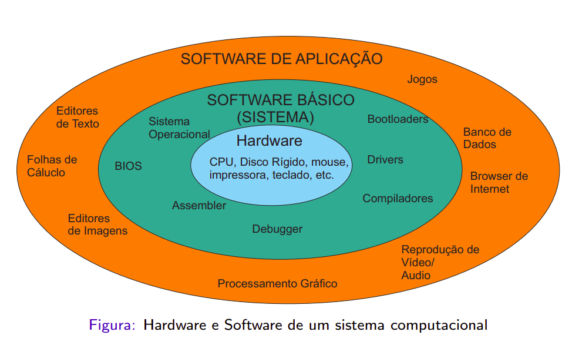

# Software Básico (CIC0104)
Repositório para a disciplina de Software Básico da Universidade de Brasília. 
Segundo o professor, um nome melhor para a disciplina seria Software de 
Sistemas.

  

## Makefile teste
[Makefile](./makefile-teste.md) para um projeto C/C++ com testes unitários com 
dicas adicionais para configurar o VSCode como um ambiente de desenvolvimento.

