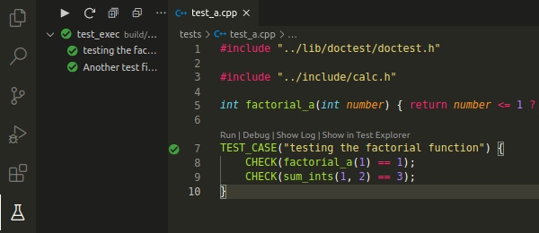

# Makefile teste
Spin-off de outro [repositório](https://github.com/yudi-azvd/make-tutorial). Makefile para um projeto C++ com testes unitários. Esse `Makefile` foi feito para ambiente Unix. Só testei no Ubuntu e no WSL.


## Começando
```sh
git clone https://github.com/yudi-azvd/sb-test
cd sb-test/
make
```

Para transformar o VSCode em um ambiente de desenvolvimento mais interessante, você pode usar...

## essas úteis extensões:
[Test Explorer UI](https://marketplace.visualstudio.com/items?itemName=hbenl.vscode-test-explorer): necessário para o C++ TestMate.

**[C++ TestMate](https://marketplace.visualstudio.com/items?itemName=matepek.vscode-catch2-test-adapter)**: habilita code lens para depuração usando o depurador do VSCode.

[Makefile Tools](https://marketplace.visualstudio.com/items?itemName=ms-vscode.makefile-tools): intellisense baseado no Makefile do projeto (acho que é isso). Além disso provê também comandos para depuração (mas acho C++ TestMate melhor).

[Trigger task On Save](https://marketplace.visualstudio.com/items?itemName=Gruntfuggly.triggertaskonsave): desencadea uma tarefa no VSCode quando salvar um tipo de aquivo. As configurações dessa extensão estão em [./.vscode/settings.json](./.vscode/settings.json)

Com **C++ TestMate** você pode ver algo assim:



Coloque breakpoints e clique em `Debug` para começar a depurar.

### Nota pra mim mesmo 
Esse `Makefile` cria subpastas desncessárias dentro de `build/`. Tenho
que arrumar isso.
